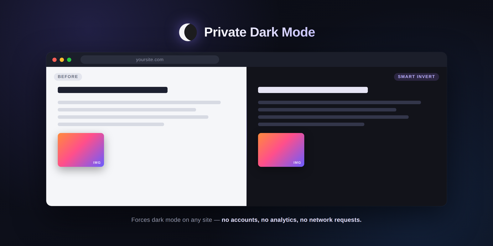

# Private Dark Mode



A small Chrome extension that forces a dark theme on every site you visit.

It exists for one reason: most dark-mode extensions ask for permission to
read and change everything on every page you visit — which they genuinely
need to do the job — and then you have no way to verify what they're
actually doing with that access. This one does the same job with a
codebase small enough to read in five minutes, and it's built so there's
nothing *to* misuse:

- No network requests, ever. Check `manifest.json` — there's no `host`
  entry pointing anywhere, no analytics SDK, no remote config, no update
  ping beyond the Chrome Web Store's own auto-update mechanism.
- No accounts, no telemetry, no error reporting.
- All settings (which sites are dark, which aren't) live in
  `chrome.storage.local` — on your device only, never synced anywhere
  unless you rely on Chrome's own bookmark/settings sync separately.
- Open source. Read every line before you trust it.

## How it works

Chrome extensions genuinely do need broad page access (`<all_urls>`) to
darken arbitrary sites — there's no way around that permission, and any
extension that does this job will ask for it. What you get in exchange
here is a codebase small enough to audit yourself:

- `background.js` — the only place any CSS gets injected, via
  `chrome.scripting.insertCSS`. As soon as a tab starts loading a page,
  it checks your preference for that site in local storage and, if dark
  mode should be on, injects the darkening stylesheet.
- The stylesheet does a **smart invert**: it flips the color of the
  whole page (`filter: invert(1) hue-rotate(180deg)`), then flips
  images, video, and canvas elements a second time so two inversions
  cancel out and photos/video look normal instead of like negatives.
- `popup.html/js` — the toolbar popup where you toggle the current site
  or change the default for new sites; it writes straight to
  `chrome.storage.local`, and the background script reacts immediately.

`chrome.scripting.insertCSS` is a deliberate choice over the more common
approach of a content script appending a `<style>` tag. A `<style>` tag
is a DOM node — the page's own JavaScript can see it, and on a site
built with a framework that manages `<head>` itself (most modern
single-page apps, including learning platforms like CertMaster) it can
get silently stripped out shortly after it's inserted, which looks like
"the toggle says on but the page never went dark." `insertCSS` instead
writes the rule directly into the browser's style engine — it isn't
part of the page's DOM at all, so page script can't touch it, and Chrome
documents this API as bypassing the page's Content-Security-Policy too.
That combination is what makes dark mode actually stick on sites that
would otherwise fight back.

### Known limitation

Smart invert is a filter trick, not real theme-awareness — it doesn't
know a site is *already* dark. Sites that ship their own dark theme can
end up looking inverted/odd. If that happens, open the popup and toggle
dark mode off for that one site; your choice is remembered.

Also, because injection is tied to page navigations, a single-page app's
*first* full load is what gets the dark styles; client-side route
changes after that don't need a fresh injection since the CSS rule
targets generic selectors (`html`, `img`, `video`, ...) that keep
applying to whatever content the app swaps in underneath.

## Installing it (unpacked, for your own use)

New to GitHub? "Installing" a repo like this one just means getting a copy
of its files onto your computer — there's nothing to run or execute on its
own. Two ways to do that:

- **Download ZIP** — easiest, no git required. On this page, click the
  green **Code** button near the top → **Download ZIP** → unzip it
  somewhere you'll remember (e.g. your Documents folder).
- **`git clone`** — if you have git installed, open a terminal and run:
  ```
  git clone https://github.com/MHT-LAB/private-dark-mode.git
  ```
  This also gives you the full commit history and makes it a one-line
  `git pull` to grab future updates, instead of re-downloading a ZIP.

Either way, you end up with a `private-dark-mode` folder on your machine.
Chrome extensions installed this way don't need to go through the Web
Store at all:

1. Open `chrome://extensions`.
2. Turn on **Developer mode** (top-right toggle).
3. Click **Load unpacked** and select the `private-dark-mode` folder.
4. Pin it from the puzzle-piece icon in the toolbar if you want it
   visible at all times.

That's it — dark mode is now on by default for every site. Click the
toolbar icon on any page to turn it off just for that site, or to change
the "new sites" default.

Optional keyboard shortcut: `Ctrl+Shift+U` (`⌃⇧U` on Mac) toggles dark
mode for the current site. You can change it at
`chrome://extensions/shortcuts`.

## Publishing to your own GitHub

```bash
# from inside this folder
git init                     # already done if you're reading this from the repo
git add -A
git commit -m "Initial commit"
git branch -M main
git remote add origin https://github.com/<your-username>/private-dark-mode.git
git push -u origin main
```

Then, if you also want it on the Chrome Web Store (optional — an unpacked
load is all that's required for personal use): zip the folder's contents
(not the folder itself), create a one-time $5 Chrome Web Store developer
account, and upload the zip at
https://chrome.google.com/webstore/devconsole. The Store review process
mainly checks that your permissions match what the code actually does —
this extension's manifest is deliberately minimal (`storage`, `scripting`,
and the page-access needed to inject CSS) so that should be straightforward.

## Permissions, explained

| Permission | Why it's needed |
|---|---|
| `storage` | Remember your per-site and default dark-mode preference, locally. |
| `scripting` | Lets the background script call `chrome.scripting.insertCSS`/`removeCSS` — the API used to apply and remove the dark stylesheet. |
| `host_permissions: <all_urls>` | Required so the extension can inject the darkening stylesheet into any page you visit, automatically, as soon as it loads — this is what every dark-mode extension needs and is the one broad permission Chrome will warn you about at install. It's also what lets the popup see which site you're currently on. |

No `tabs`, no `activeTab`, no `webRequest`, no `cookies`, no `history` —
none of those are used or requested.

## License

MIT — see `LICENSE`.
